  

# ⚔️ Awesome Real-Time Strategy (RTS) Video Games & Open-Source Engines 🎮

  
  
  
  

A curated list of commercial **Real-Time Strategy (RTS)** SaaS platforms, standalone video games, and **open-source RTS game engines** written in C++, C#, Java, and Lua. Discover top titles featuring base building, resource management, tactical unit production, and real-time combat. 🚀

---

## 📌 Table of Contents
- [📊 Market Overview](#-market-overview)
- [🏢 Commercial & SaaS RTS Platforms](#-commercial--saas-rts-platforms)
- [💻 Open-Source RTS Games & Engines](#-open-source-rts-games--engines)
- [🤝 How to Contribute](#-how-to-contribute)
- [💖 Support & Sponsorship](#-support--sponsorship)
- [📈 Star History](#-star-history)
- [⚠️ Disclaimer](#%EF%B8%8F-disclaimer)

---

## 📊 Market Overview

> 💡 **Market Size & Structure**: The global PC Real-Time Strategy (RTS) and strategy video game market is estimated at **$11.5 Billion USD in 2026**. The sector is **moderately fragmented** — dominated at the top tier by major publishers (Microsoft, Blizzard Entertainment, Electronic Arts, and SEGA/Creative Assembly) holding flagship IP, while a vibrant ecosystem of independent studios (Shiro Games, Blackbird Interactive, Firefly Studios) and community-driven open-source projects capture niche tactical, economic, and simulation sub-genres.

---

## 🏢 Commercial & SaaS RTS Platforms

Commercial RTS games and hosted platforms ranked by publisher market valuation/revenue (descending). 👑

| Game / Platform | Publisher / Parent Company | Company Valuation / Revenue | Base Pricing (USD) | Free Tier / Trial Limit | Key Features |
| :--- | :--- | :--- | :--- | :--- | :--- |
| **[Age of Empires](https://www.ageofempires.com/)** | Microsoft 🏰 | **$3.84 Trillion** (Market Cap) | $34.99 (Base Game) | Accessible via PC Game Pass 14-day trial ($1 limit); no standalone free trial | Historical campaigns, deep base building, active competitive multiplayer. |
| **[StarCraft II](https://starcraft2.com/)** | Blizzard Entertainment (Microsoft) 🚀 | **$3.84 Trillion** (Parent Market Cap) | $39.99 (Campaign Collection) | **Free-to-Play**: Full Wings of Liberty campaign, vs AI, custom maps, & all Co-op commanders up to level 5 free forever | Gold standard competitive RTS with asymmetric faction design and esports scene. |
| **[Warcraft III: Reforged](https://playwarcraft3.com/)** | Blizzard Entertainment (Microsoft) ⚔️ | **$3.84 Trillion** (Parent Market Cap) | $29.99 (Standard Edition) | No free trial available | Classic RTS remaster, hero units, custom map engine that birthed the MOBA genre. |
| **[Command & Conquer Remastered](https://www.ea.com/games/command-and-conquer)** | Electronic Arts (EA) 💥 | **$53.0 Billion** (Market Cap prior to private acquisition) | $19.99 (Collection) | No free trial available | Remastered Tiberian Dawn & Red Alert with modernized UI, 4K graphics, & FMV cutscenes. |
| **[Total War: Warhammer III](https://www.totalwar.com/)** | Creative Assembly / SEGA 🛡️ | **$4.3 Billion** (SEGA Market Cap) | $59.99 (Base Game) | Free weekend promotions on Steam (typically 3–4 days during major sales) | Turn-based grand strategy map merged with massive real-time tactical battles. |
| **[Company of Heroes 3](https://www.companyofheroes.com/)** | Relic Entertainment 🎖️ | **$25.5 Million** (Annual Revenue) | $59.99 (Base Game) | Free multiplayer/demo weekends on Steam periodically | Squad-based WWII tactical combat, destructible environments, & dynamic campaign map. |
| **[Northgard](https://www.northgard.net/)** | Shiro Games 🪓 | **~$15.0 Million** (Annual Revenue) | $29.99 (Base Game) | Free Steam trial events during seasonal sales | Viking clan strategy combining territory expansion, resource management, & winter survival. |
| **[Homeworld 3](https://www.homeworld3.com/)** | Blackbird Interactive 🌌 | **~$10.0 Million** (Annual Revenue) | $59.99 (Standard Edition) | Free demo available during Steam Next Fest | Fully 3D space tactical combat with cinematic campaign and co-op roguelite modes. |
| **[Stronghold: Definitive Edition](https://www.stronghold-game.com/)** | Firefly Studios 🏹 | **~$5.0 Million** (Annual Revenue) | $14.99 (Base Game) | Free demo available on Steam | Castle building simulation combining economic castle management and siege warfare. |

---

## 💻 Open-Source RTS Games & Engines

Open-source RTS games, engine reimplementations, and strategy simulations ordered by **GitHub Stars_Count** (descending). 🌟

| Project Name | GitHub_Stars | License | Primary Tech Stack | Description |
| :--- | :--- | :--- | :--- | :--- |
| **[Mindustry](https://github.com/Anuken/Mindustry)** |  | GPL-3.0 | Java / LibGDX ☕ | Hybrid factory-management building game with tower-defense RTS unit tactics. |
| **[OpenRA](https://github.com/OpenRA/OpenRA)** |  | GPL-3.0 | C# / OpenGL / OpenAL ⚡ | Engine reimplementation of classic C&C Red Alert, Tiberian Dawn, and Dune 2000. |
| **[OpenRCT2](https://github.com/OpenRCT2/OpenRCT2)** |  | GPL-3.0 | C++ / C 🎢 | Open-source re-implementation of RollerCoaster Tycoon 2 real-time management. |
| **[Unciv](https://github.com/yairm210/Unciv)** |  | GPL-3.0 | Kotlin / LibGDX 📱 | Open-source 2D remake of Civilization V for Android and Desktop. |
| **[OpenTTD](https://github.com/OpenTTD/OpenTTD)** |  | GPL-2.0 | C++ 🚂 | Open-source urban transport simulation & real-time economic management game. |
| **[Endless Sky](https://github.com/endless-sky/endless-sky)** |  | GPL-3.0 | C++ / OpenGL 🚀 | 2D space trading and combat strategy game inspired by Escape Velocity. |
| **[CorsixTH](https://github.com/CorsixTH/CorsixTH)** |  | MIT | C++ / Lua 🏥 | Open-source clone of Theme Hospital business simulation engine. |
| **[Beyond All Reason](https://github.com/beyond-all-reason/Beyond-All-Reason)** |  | GPL-2.0 | Lua / C++ (Spring) 🤖 | Total Annihilation successor built on Spring Engine with large-scale 3D unit battles. |
| **[Spring Engine](https://github.com/spring/spring)** |  | GPL-2.0 | C++ / Lua ⚙️ | Powerful 3D RTS game engine supporting full physics, terrain deformation, & scripting. |
| **[Warzone 2100](https://github.com/Warzone2100/warzone2100)** |  | GPL-2.0 | C++ / Vulkan 🎯 | Post-apocalyptic 3D RTS featuring modular unit design, extensive research, & campaigns. |
| **[Widelands](https://github.com/widelands/widelands)** |  | GPL-2.0 | C++ 🌲 | Economic settlement strategy game heavily inspired by Settlers II. |
| **[0 A.D.](https://github.com/0ad/0ad)** |  | GPL-2.0 | C++ / JavaScript 🏛️ | Historical 3D RTS depicting ancient civilizations, economic growth, & naval warfare. |
| **[OpenSAGE](https://github.com/OpenSAGE/OpenSAGE)** |  | GPL-3.0 | C# .NET 🛠️ | Open-source engine rewrite for SAGE games (C&C Generals, Battle for Middle-earth). |
| **[TripleA](https://github.com/triplea-game/triplea)** |  | GPL-3.0 | Java 🎲 | Turn-based & real-time grand tactical strategy engine based on Axis & Allies rules. |
| **[OpenHV](https://github.com/OpenHV/OpenHV)** |  | GPL-3.0 | C# 👾 | Pixel-art sci-fi real-time strategy game built on top of the OpenRA engine. |
| **[Zero-K](https://github.com/ZeroK-RTS/Zero-K)** |  | GPL-2.0 | Lua / C++ 💥 | Fast-paced competitive 3D RTS on Spring Engine with simulated projectile physics. |
| **[MegaGlest](https://github.com/MegaGlest/megaglest-source)** |  | GPL-3.0 | C++ 🐉 | 3D fantasy RTS game engine featuring 7 distinct factions and modding capabilities. |
| **[UFO: Alien Invasion](https://github.com/ufoai/ufoai)** |  | GPL-2.0 | C / C++ 👽 | Tactical strategy and real-time geoscape management game inspired by X-COM. |

---

## 🤝 How to Contribute

1. Fork this repository. 🍴
2. Add or update entries in `README.md` keeping formatting consistent.
3. Ensure open-source projects include proper GitHub repository links and standard badges.
4. Submit a Pull Request detailing your changes. 🚀

---

## 💖 Support & Sponsorship

Thank you for exploring and supporting this curated list of Real-Time Strategy games and open-source engines! ⭐

If you find this list valuable, please consider:
- **Starring** ⭐ this repository to increase its visibility.
- **Forking** 🍴 and contributing new RTS projects or engine updates.
- **Sharing** 📢 it with fellow strategy gamers, developers, and open-source enthusiasts!

☕ If you'd like to buy me a coffee or support ongoing open-source curation, visit my **[GitHub Sponsor Dashboard](https://github.com/sponsors/ishandutta2007)**.

---

## 📈 Star History

---

## ⚠️ Disclaimer

- Community-curated resource for game developers, RTS players, and open-source strategy game enthusiasts.
- Pricing, game availability, and publisher market values reflect public data as of October 2026.
- Always check official digital storefronts (Steam, GOG, Epic Games Store, Microsoft Store) for active discounts.

---

  <b>Made with ❤️ for RTS enthusiasts, strategy gamers, and open-source game developers.</b>

